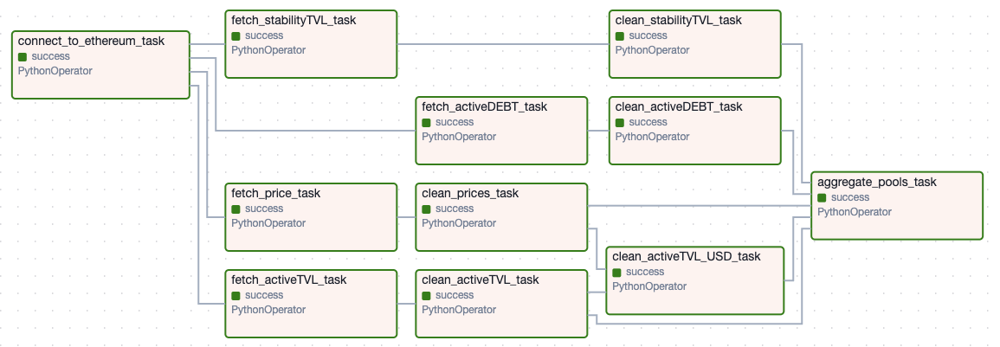

# Liquity V2 Data Pipeline

This repository contains an Apache Airflow DAG for fetching, cleaning, and aggregating data related to Liquity V2 active pools, stability pools, and collateral prices.

## Current DAG

The current DAG performs the following tasks:
- Fetches data for active pools, stability pools, and price feeds.
- Cleans the fetched data.
- Aggregates the data by active pools into a nested dictionary structure.

Below is a screenshot of the current DAG:

## Future Work

I plan to add a new DAG for fetching troves distribution. This DAG will:
- Fetch data related to troves (e.g., collateral ratios, debt amounts).
- Clean and process the troves data.
- Integrate the troves data with the existing pipeline.
