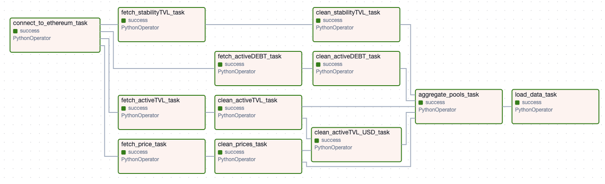
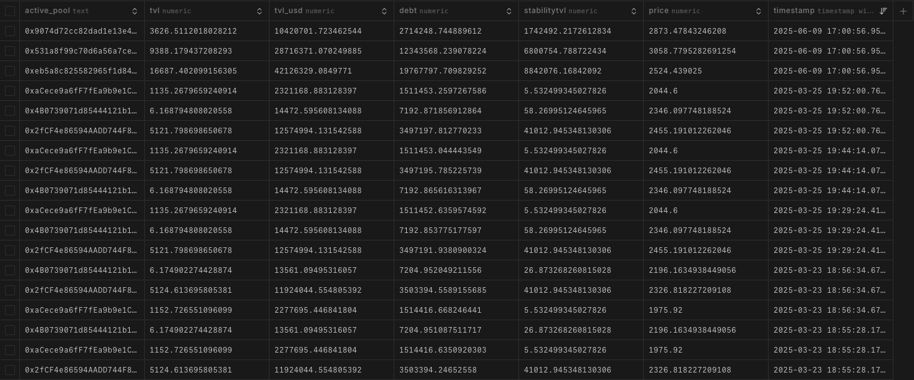
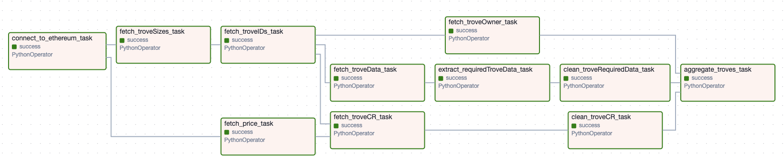
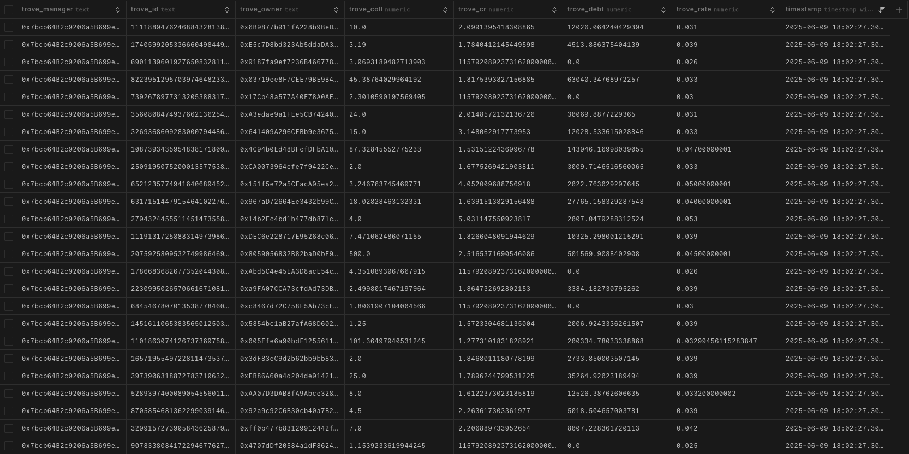
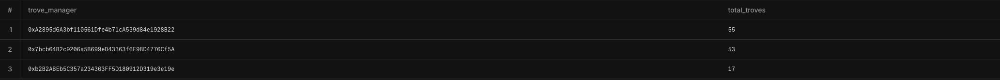

# Liquity V2 Data Pipeline

This repository contains an Apache Airflow DAG for fetching, cleaning, and aggregating data related to Liquity V2 active pools, stability pools, and collateral prices.

## Current DAGs

We now have two DAGs performing the following tasks:

1. **Active Pools DAG:**
   - Fetches data for active pools, stability pools, and price feeds.
   - Cleans the fetched data.
   - Aggregates the data by active pools into a nested dictionary structure.

2. **Troves DAG:**
   - Fetches data from trove managers, sorted troves, trove NFT, and price feeds.
   - Cleans the fetched data.
   - Aggregates the data by trove manager into a nested dictionary structure with trove IDs, owner addresses, and relevant variables of a trove.

### General
Below is a screenshot of the current DAG for Liquity V2:

Below is a screenshot of the current table for Liquity V2:

### Troves
Below is a screenshot of the current DAG for Liquity V2 Troves:

Below is a screenshot of the current table for Liquity V2 Troves:

Below is a screenshot showing the trove_manager and number of troves, which you can compare with the Liquity V2 explorer at https://liquityv2.defiexplore.com/.

## Future Work

Future improvements and enhancements are now tracked in the [Issues](https://github.com/oliinykm99/liquity_v2/issues) tab of this repository.

Please check the open issues for planned features, bug fixes, and contributions in progress.
